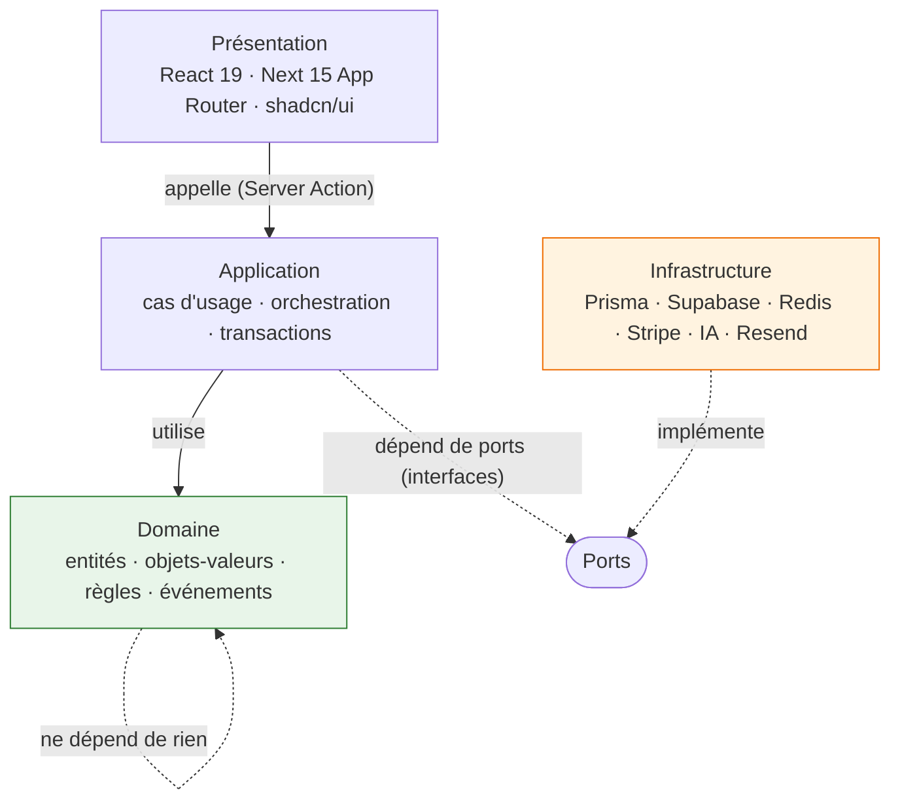
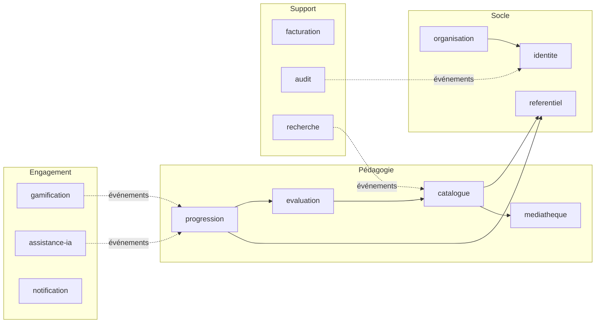

# 01 — Architecture logicielle

## 1. Principe directeur

**Le domaine ne connaît ni Next.js, ni Supabase, ni Prisma.**

Un module métier est un dossier qui contient son domaine, ses cas d'usage, ses
ports et ses adaptateurs. On doit pouvoir supprimer le dossier `gamification/`
et que l'application compile encore. C'est le test de découplage, et il est
vérifié automatiquement ([§6](#6-vérification-automatique-du-découplage)).

## 2. Couches



Règle de dépendance : **les flèches pointent toujours vers l'intérieur.**
Le domaine est au centre et n'importe rien. L'infrastructure est en périphérie
et n'est jamais importée directement par l'application — seulement injectée.

### Ce que contient chaque couche

| Couche | Contient | Ne contient jamais |
|---|---|---|
| Domaine | Entités, objets-valeurs, invariants, événements de domaine | `async`, SQL, HTTP, `import` de librairie tierce |
| Application | Cas d'usage, transactions, autorisations métier | JSX, requêtes Prisma directes |
| Infrastructure | Repositories Prisma, clients Supabase/Redis/Stripe/IA | Règles métier |
| Présentation | Composants, Server Actions, formulaires, rendu | Règles métier, accès base direct |

## 3. Découpage en modules (bounded contexts DDD)



Les traits pleins sont des dépendances directes assumées. **Les pointillés sont
des abonnements à des événements de domaine** : le module amont ignore l'existence
du module aval. C'est ce qui rend `gamification` et `assistance-ia` supprimables.

| Module | Responsabilité | Agrégats principaux |
|---|---|---|
| `identite` | Comptes, sessions, rôles, consentements | Compte, Session, Consentement |
| `organisation` | Académies, établissements, classes, inscriptions, années | Établissement, Classe, Inscription |
| `referentiel` | Diplômes, compétences, capacités, objectifs, savoirs, versions | Référentiel, Compétence |
| `catalogue` | Matières, modules, chapitres, leçons, blocs de contenu | Cours, Leçon |
| `mediatheque` | Fichiers, modèles 3D, transcodage, droits d'usage | Ressource |
| `evaluation` | Exercices, quiz, devoirs, CCF, tentatives, correction | Évaluation, Tentative |
| `progression` | Acquisition des compétences, temps passé, assiduité | Progression, AcquisCompétence |
| `gamification` | XP, badges, succès, classements, arbre de compétences | Profil de jeu |
| `assistance-ia` | Tuteur, génération, détection, quotas | Conversation, TâcheIA |
| `notification` | Emails (Resend), notifications internes | Notification |
| `facturation` | Abonnements Stripe, sièges, quotas | Abonnement |
| `audit` | Journal immuable des actions sensibles | ÉvénementAudit |
| `recherche` | Indexation et requêtes | (projection, pas d'agrégat) |

## 4. Arborescence

```
src/
  domaines/
    referentiel/
      domaine/            # entités, VO, règles — zéro dépendance
        competence.ts
        referentiel.ts
        evenements.ts
      application/         # cas d'usage
        importer-referentiel.ts
        rattacher-ressource-competence.ts
      ports/               # interfaces que l'infra doit satisfaire
        depot-referentiel.ts
      infrastructure/      # implémentations
        depot-referentiel-prisma.ts
      index.ts             # SEULE surface publique du module
    organisation/ …
    catalogue/ …
  app/                     # Next.js App Router — présentation uniquement
    (public)/
    (eleve)/
    (enseignant)/
    (pilotage)/
    (admin)/
    api/
  composants/              # shadcn/ui + composants transverses
  noyau/                   # bus d'événements, résultat, erreurs, journal, i18n
  test/
```

**Règle d'import** : `src/domaines/X/**` n'est jamais importé depuis l'extérieur
du module ; on passe par `src/domaines/X/index.ts`. Un module ne peut importer
que l'`index.ts` d'un autre module, et seulement s'il figure dans la matrice §3.

## 5. Conventions de code

- **Français partout**, y compris variables, fonctions, composants, tables.
  Hérité de RAAI-Formation. Ne pas mélanger les langues dans un même identifiant.
- **TypeScript strict**, `noUncheckedIndexedAccess` activé. Aucun `any`.
- **Pas d'exception pour le métier** : les cas d'usage renvoient
  `Resultat<T, ErreurMetier>`. Les exceptions sont réservées aux bugs.
- **Objets-valeurs plutôt que `string`** pour les identifiants :
  `IdentifiantEleve`, `CodeCompetence`. Un `string` passé au mauvais paramètre
  est un incident de production ; un type marqué est une erreur de compilation.
- **Les commentaires expliquent pourquoi, pas quoi.**
- Toute date en base est `timestamptz`. Toute date affichée passe par le fuseau
  de l'établissement.

## 6. Vérification automatique du découplage

Le découplage se dégrade silencieusement s'il n'est pas mesuré. En CI :

1. **ESLint `import/no-restricted-paths`** : interdit les imports transversaux
   hors `index.ts`, et tout import d'`infrastructure` depuis `domaine`.
2. **`dependency-cruiser`** : la matrice de dépendances §3 est un fichier de
   configuration, pas un schéma décoratif. Une flèche non déclarée casse le build.
3. **Test de suppression** : un job hebdomadaire retire `gamification` et
   `assistance-ia` et vérifie que le build passe.

## 7. Bus d'événements de domaine

Un module publie ; il n'appelle pas.

```ts
// domaines/progression/domaine/evenements.ts
export type CompetenceAcquise = {
  readonly type: 'progression.competence-acquise'
  readonly eleveId: IdentifiantEleve
  readonly competenceId: CodeCompetence
  readonly niveau: NiveauAcquisition
  readonly surveneuLe: Date
}
```

- **En MVP** : bus en mémoire, exécution synchrone dans la transaction, avec
  fallback en table `evenements_domaine` pour les abonnés lents. C'est suffisant
  et cela évite d'introduire une file dès le premier jour.
- **En V2** : consommation asynchrone via Supabase Realtime ou une file dédiée,
  quand la gamification et l'IA génèrent assez de travail pour le justifier.

Les événements sont **au passé** et **immuables**. Ils sont aussi la matière
première du journal d'audit et de la ré-indexation de la recherche.

## 8. Tests

| Niveau | Cible | Outil |
|---|---|---|
| Domaine | 100 % des règles métier, pur, instantané | Vitest |
| Application | Cas d'usage avec ports en double | Vitest |
| Permissions | Chaque table × chaque rôle | Vitest + Postgres éphémère |
| Intégration | Server Actions, base réelle | Vitest + Testcontainers |
| Bout en bout | Les 6 parcours critiques de [05](05-parcours-utilisateurs.md) | Playwright |
| Accessibilité | Parcours élève et enseignant | axe-core en CI |

Les tests de permissions sont **bloquants**. Une régression de cloisonnement entre
établissements est l'incident qui tue le projet ; elle ne peut pas dépendre d'une
relecture humaine.
