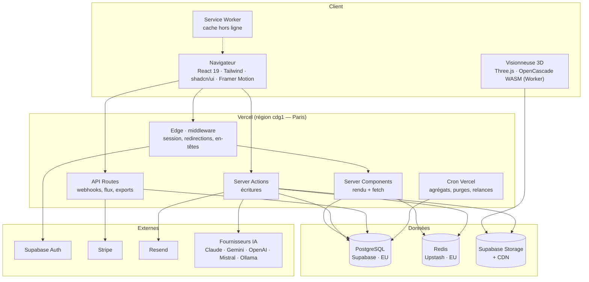
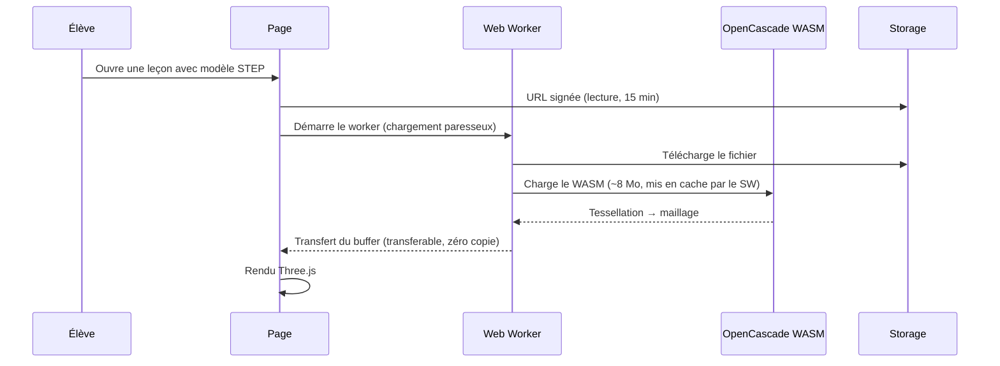

# 02 — Architecture technique

## 1. Vue d'ensemble



## 2. Choix et justifications

| Couche | Choix | Pourquoi celui-là |
|---|---|---|
| Framework | Next.js 15, App Router | RSC réduisent le JS envoyé — décisif sur Chromebooks et 4G rurale |
| Rendu | RSC par défaut, Client Components à la feuille | Le contenu pédagogique est statique par nature |
| Écritures | Server Actions | Pas de couche REST à maintenir pour l'usage interne |
| API Routes | Webhooks, exports, flux, intégrations tierces | Ce qui a besoin d'une URL stable ([06](06-api-server-actions.md)) |
| ORM | Prisma | Typage de bout en bout, migrations versionnées |
| Base | PostgreSQL (Supabase) | RLS native — le cloisonnement multi-établissements vit en base, pas dans le code |
| Cache | Redis (Upstash) | Sessions élèves, quotas IA, classements, limitation de débit |
| Stockage | Supabase Storage | Cohérence avec l'auth ; URLs signées |
| Auth | Supabase Auth | Comptes adultes ; les élèves mineurs suivent un autre chemin ([07](07-permissions.md)) |
| Hébergement | Vercel, région `cdg1` | Latence FR, RGPD |
| Paiement | Stripe | Abonnements par sièges |
| Emails | Resend | Transactionnel ; jamais vers un mineur en mode minimal |
| 3D | Three.js + OpenCascade WASM | Seule voie viable pour lire du STEP dans le navigateur |

## 3. Organisation Supabase

Comme dans RAAI-Formation, **rien ne vit dans `public`**. Un projet Supabase RAAI
héberge plusieurs applications, chacune dans son espace de noms.

```
schéma  raai_apprendre        -- tables applicatives
schéma  raai_apprendre_ref    -- référentiels nationaux (lecture quasi seule)
schéma  raai_apprendre_audit  -- journal immuable, append-only
```

`raai_apprendre` et `raai_apprendre_ref` sont exposés à PostgREST
(Project Settings › API › Exposed schemas). **`raai_apprendre_audit` ne l'est
jamais** : il n'est accessible que par des fonctions `SECURITY DEFINER`.

Prisma pointe sur ces schémas via `multiSchema`. Les migrations Prisma sont la
source de vérité du schéma ; les politiques RLS et les fonctions SQL vivent dans
des migrations SQL versionnées à côté ([10](10-deploiement.md)).

## 4. Cache

Trois niveaux, du moins cher au plus cher :

| Niveau | Contenu | Invalidation | TTL |
|---|---|---|---|
| CDN Vercel | Pages publiques, leçons publiées, médias | `revalidateTag('lecon:<id>')` à la publication | Jusqu'à invalidation |
| Redis | Session élève, quotas IA, classements, compteurs | Écriture directe | 30 s – 24 h |
| Mémoire process | Référentiels, jetons de design | Redéploiement | Durée du process |

Le levier décisif est le premier. Une leçon est **identique pour tous les élèves
d'une classe** : c'est une page statique avec une surcouche de progression
personnelle chargée séparément. À 9h00, le pic ne doit pas atteindre Postgres.

Découpage systématique de chaque écran :

```
Page (statique, CDN)      →  contenu pédagogique, identique pour tous
  └─ îlot (dynamique)     →  progression, notes, badges de l'élève courant
```

Balise `<Suspense>` autour de l'îlot : le cours s'affiche immédiatement, la
progression arrive ensuite. Sur un réseau de MFR, cette distinction est la
différence entre « ça marche » et « c'est inutilisable ».

## 5. Visionneuse 3D



Règles :

- **Le WASM ne bloque jamais le fil principal.** Tout se passe dans un Worker.
- **Chargement paresseux** : le bundle 3D n'est jamais dans le bundle initial.
  Une leçon sans modèle 3D ne paie rien.
- **Pré-tessellation côté serveur** : à l'import, un job produit une version GLB
  allégée. Le STEP intégral n'est chargé qu'à la demande explicite
  (« voir le modèle exact »). C'est ce qui rend la 3D utilisable sur tablette.
- **Formats propriétaires** (SLDPRT, CATPart) : jamais parsés dans le navigateur.
  Stockés comme fichiers téléchargeables, avec conversion hors ligne vers STEP/GLB
  quand elle est possible. Ne pas promettre plus.
- Repli obligatoire : si WebGL est indisponible, on affiche les vues 2D
  pré-rendues. Le parc des établissements impose ce repli.

## 6. Budget de performance (bloquant en CI)

| Métrique | Budget |
|---|---|
| JS initial, page leçon | < 120 Ko compressé |
| LCP, 4G lente | < 2,0 s |
| TTFB, page en cache | < 200 ms |
| Bundle 3D | Hors bundle initial, systématiquement |
| Poids médias par leçon | < 5 Mo par défaut, alerte auteur au-delà |

## 7. Hors ligne

Service Worker, stratégie ciblée — on ne tente pas de tout rendre disponible :

- **Cache-first** : coquille applicative, polices, icônes, WASM.
- **Stale-while-revalidate** : leçons déjà consultées.
- **File d'attente** : réponses de quiz saisies hors ligne, rejouées à la
  reconnexion, avec résolution de conflit « le serveur gagne sur les notes ».

Cas d'usage réel visé : l'élève ouvre son cours dans le car ou en exploitation
agricole, où il n'y a pas de réseau.

## 8. Observabilité

| Besoin | Outil |
|---|---|
| Erreurs | Sentry (avec masquage des données élèves) |
| Performance | Vercel Speed Insights + Web Vitals |
| Logs applicatifs | Journal structuré JSON, corrélé par `idRequete` |
| Base | Supabase Reports + `pg_stat_statements` |
| Métier | Tableau interne : connexions/jour, leçons ouvertes, compétences validées |
| Coût IA | Jetons et euros par établissement et par tâche ([08](08-architecture-ia.md)) |

Aucune donnée personnelle d'élève ne sort vers un outil tiers d'observabilité.
Les identifiants sont transmis sous forme d'UUID, jamais de prénom.
