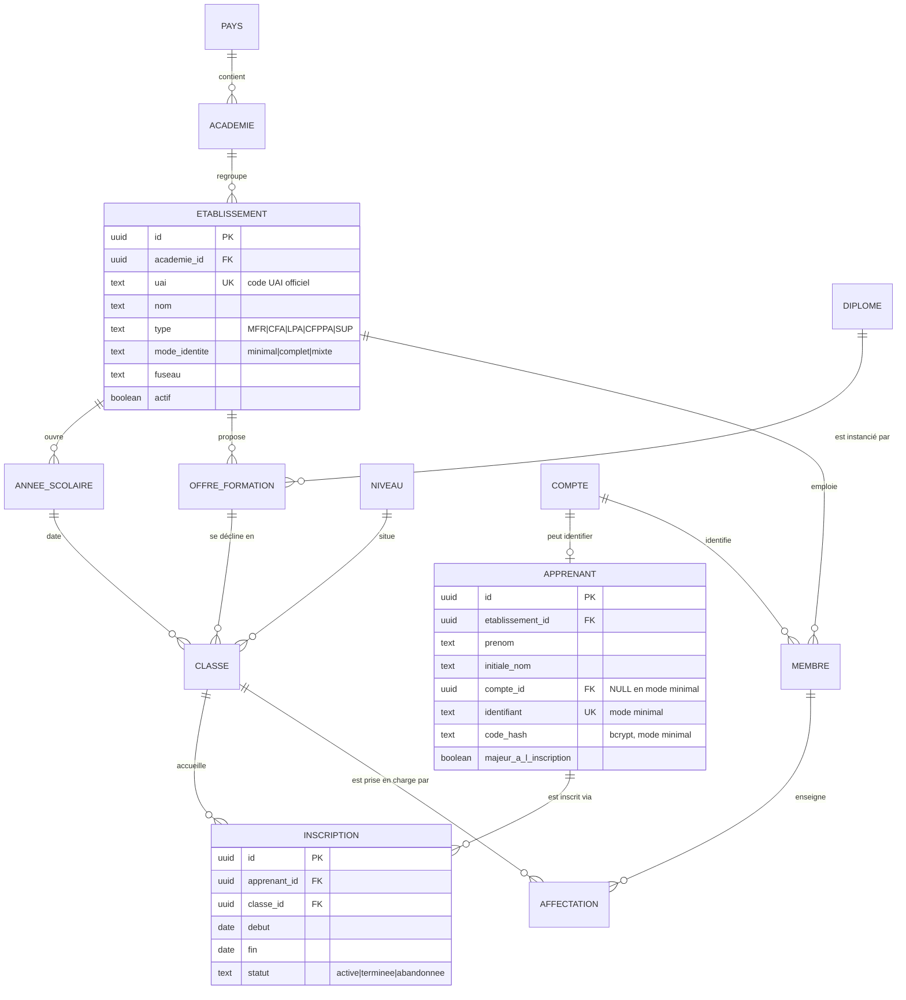
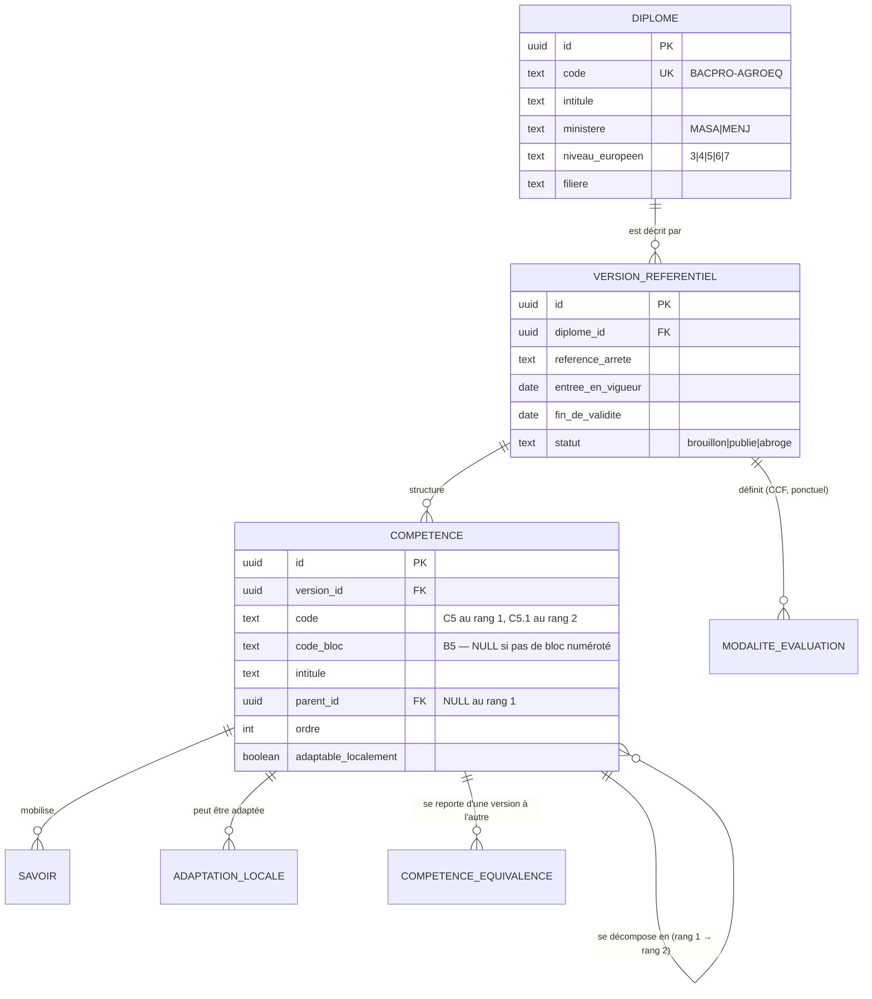
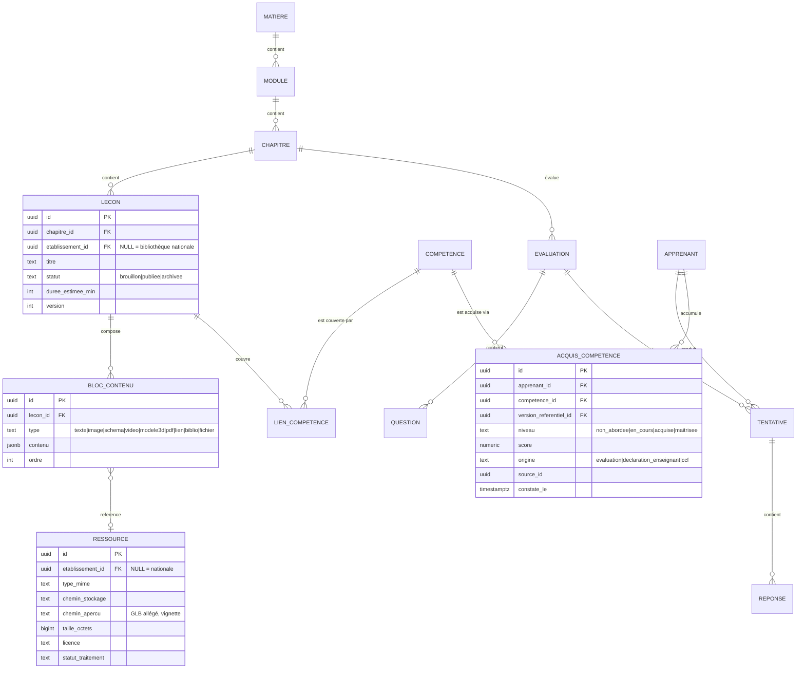

# 03 — Modèle de données

## 1. Principes

1. **Deux arbres, un point de rencontre.** L'arbre organisationnel appartient aux
   établissements ; l'arbre référentiel est national. Ils se rejoignent
   exclusivement sur `acquis_competence`. Aucune table de référentiel ne porte
   d'`etablissement_id` — jamais.
2. **Cloisonnement par ligne.** Une seule base, RLS partout. `etablissement_id`
   est présent sur toute table portant une donnée d'établissement, y compris
   quand il serait déductible par jointure : la RLS doit rester peu coûteuse.
3. **Minimisation.** Une colonne de donnée personnelle doit être justifiée par un
   écran existant. En mode minimal, un élève c'est un prénom et une initiale.
4. **Immuabilité de l'évaluation.** Une tentative n'est jamais modifiée. Une
   correction crée une nouvelle ligne.
5. **Versionnement des référentiels.** Un référentiel change (arrêté modifié) ;
   les acquis passés doivent rester lisibles dans leur version d'origine.

## 2. ERD — socle organisationnel

Points d'attention :

- `APPRENANT.compte_id` est **nullable**. C'est la traduction en base de la
  décision « hybride » : un même établissement peut avoir des mineurs sans compte
  et des majeurs avec compte Supabase Auth. Aucune requête ne doit supposer
  l'existence d'un compte.
- `ETABLISSEMENT.uai` : le code UAI officiel sert de clé de rapprochement avec
  les annuaires ministériels. Unique, contrôlé au format.
- `INSCRIPTION` est historisée : un élève redoublant, ou changeant de classe en
  cours d'année, produit deux lignes. La progression suit l'apprenant, pas
  l'inscription.

## 3. ERD — référentiel national

Aucun `etablissement_id` dans ce sous-schéma, à l'exception documentée ci-dessous.
C'est vérifié par un test.

> **Corrigé au schéma, avant la première migration.** L'analyse d'un référentiel
> réel ([12](12-import-referentiels.md#3-structure-réelle-du-référentiel-rénové))
> avait montré deux écarts avec l'ERD ci-dessus, tous deux tranchés :
> 1. `BLOC_COMPETENCE` et `COMPETENCE` étaient donnés en relation 1–n. Ils sont en
>    relation **1–1** : le référentiel pose « chaque capacité globale correspond à
>    un bloc de compétences ». Le schéma retenu va plus loin que la simple fusion —
>    **une seule table `competence`, auto-référencée** par `parent_id`, porte les
>    deux rangs : `C5` au rang 1 (`parent_id` nul), `C5.1` au rang 2. Le bloc
>    devient une colonne, `code_bloc`, nulle pour une capacité sans bloc numéroté.
> 2. La dernière capacité (module d'adaptation professionnelle) est **définie
>    régionalement**. D'où le drapeau `adaptable_localement` sur la capacité, et la
>    table `adaptation_locale` qui porte, elle, un `etablissement_id` — **seule
>    exception admise** à la règle ci-dessus, et explicitement exclue du test qui
>    la vérifie.

Une `VERSION_REFERENTIEL` publiée est **immuable**. Corriger une coquille impose
une nouvelle version, et une table de correspondance `competence_equivalence`
permet de reporter les acquis d'une version à la suivante — sans quoi chaque
réforme d'arrêté effacerait la progression des élèves en cours de cycle.

## 4. ERD — contenu pédagogique et évaluation

### Le bloc de contenu, brique unique

Une leçon n'est pas du HTML : c'est une **liste ordonnée de blocs typés**, chacun
avec un `contenu` JSONB validé par un schéma Zod propre à son `type`. C'est ce
qui permet d'ajouter un type de bloc (simulation, carte interactive, quiz
intégré) sans migration de schéma, et de rendre la même leçon en HTML, en PDF
exportable et en lecture audio.

Le HTML libre est proscrit : il rendrait l'export, l'accessibilité et la sécurité
XSS impossibles à garantir.

### `ACQUIS_COMPETENCE`, le point de rencontre

C'est la seule table qui référence à la fois un apprenant (établissement) et une
compétence (national). Elle porte `version_referentiel_id` pour rester lisible
après une réforme, et `origine` + `source_id` pour la traçabilité : un acquis
doit toujours pouvoir répondre à « d'où vient cette validation ? ».

## 5. Tables transverses

| Table | Rôle | Particularité |
|---|---|---|
| `session_apprenant` | Jeton élève en mode minimal | Hérité de `jetons_eleve` ; expire à 30 j, révocable par l'enseignant |
| `evenement_domaine` | Journal des événements publiés | Alimente gamification, IA, recherche |
| `audit.evenement` | Actions sensibles | Schéma non exposé, append-only, `REVOKE UPDATE, DELETE` |
| `abonnement`, `siege` | Stripe | Compteur de sièges par établissement |
| `quota_ia` | Consommation IA | Par établissement × mois ; hérité de RAAI-Formation |
| `presence_jour` | Temps passé par jour | Une ligne par apprenant et par jour, pas d'événement fin |
| `consentement` | RGPD | Type, version du texte, date, auteur ; jamais supprimé |

## 6. Index et performance

Les requêtes chaudes, dans l'ordre de fréquence réelle :

| Requête | Index |
|---|---|
| Tableau de bord élève | `acquis_competence (apprenant_id, competence_id)` |
| Suivi d'une classe par l'enseignant | `inscription (classe_id, statut)` + `tentative (apprenant_id, evaluation_id, cree_le desc)` |
| Leçons d'un chapitre | `lecon (chapitre_id, statut, ordre)` |
| Couverture du référentiel | `lien_competence (competence_id, lecon_id)` |
| Recherche | GIN sur `to_tsvector('french', …)` |
| Classement de classe | Redis, **pas** Postgres |

Deux points structurants :

- **`etablissement_id` en tête de tout index composite** sur les tables
  cloisonnées. La RLS ajoute systématiquement ce prédicat ; un index qui ne le
  porte pas en premier ne sera pas utilisé.
- **Partitionnement de `tentative` et `presence_jour` par année scolaire** dès
  V1. Ce sont les deux tables qui grossissent linéairement avec les usages :
  à 100 000 élèves, `tentative` dépasse la centaine de millions de lignes en deux
  ans. Les partitions anciennes deviennent lecture seule.

## 7. Stratégie de migration depuis RAAI-Formation

| Source | Cible | Traitement |
|---|---|---|
| `raai_formation.filieres`, `filiere_matieres` | `diplome`, `matiere` | Reprise directe, enrichie du code officiel |
| Contenu des 51 cours (`src/content/*.json`) | `lecon`, `bloc_contenu` | Script de conversion vers les blocs typés — **le contenu ne se réécrit pas** |
| `eleves`, `jetons_eleve` | `apprenant`, `session_apprenant` | Reprise du modèle bcrypt ; les établissements existants démarrent en `mode_identite = 'minimal'` |
| `progression`, `scores_jeux` | `acquis_competence`, profil de jeu | Conversion avec `origine = 'import'` |
| `formateurs` | `compte`, `membre` | Un formateur devient membre d'un établissement créé pour lui |
| `quota_ia` | `quota_ia` | Reprise, clé passée de formateur à établissement |

La bascule se fait établissement par établissement, pas d'un bloc. L'ancienne
application reste en lecture seule pendant une année scolaire.

## 8. Ce qu'on ne stocke pas

- Nom de famille complet, date de naissance, adresse, téléphone d'un élève mineur.
- Adresse IP au-delà de 7 jours (journal technique uniquement).
- Contenu des conversations avec le tuteur IA au-delà de 12 mois.
- Aucune donnée de santé, d'origine, d'opinion — quel qu'en soit le prétexte
  pédagogique.
