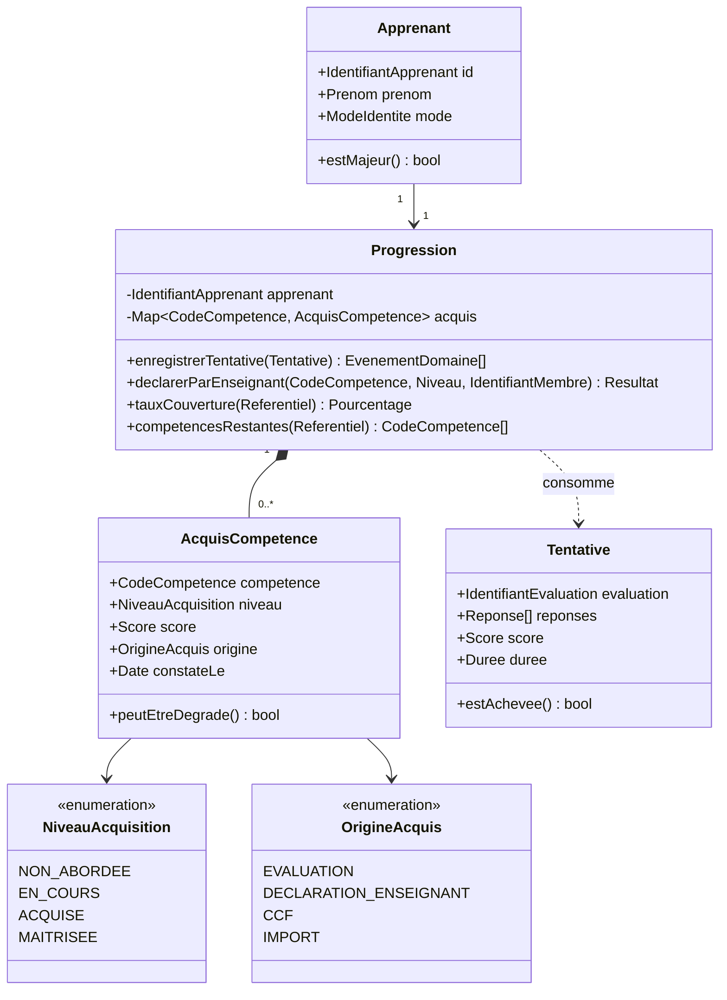
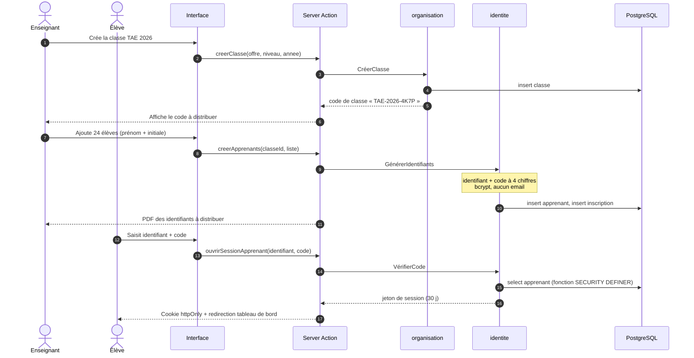
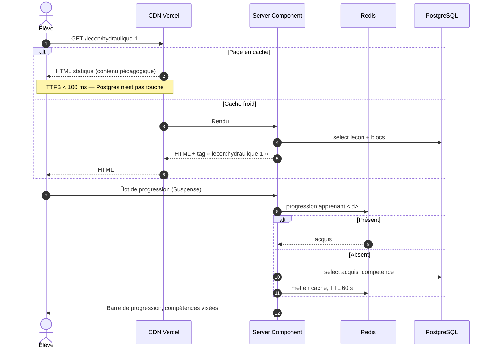
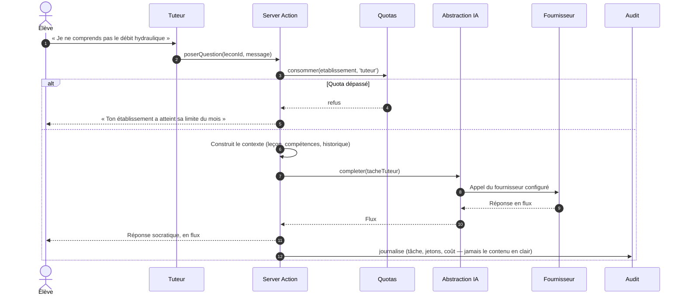
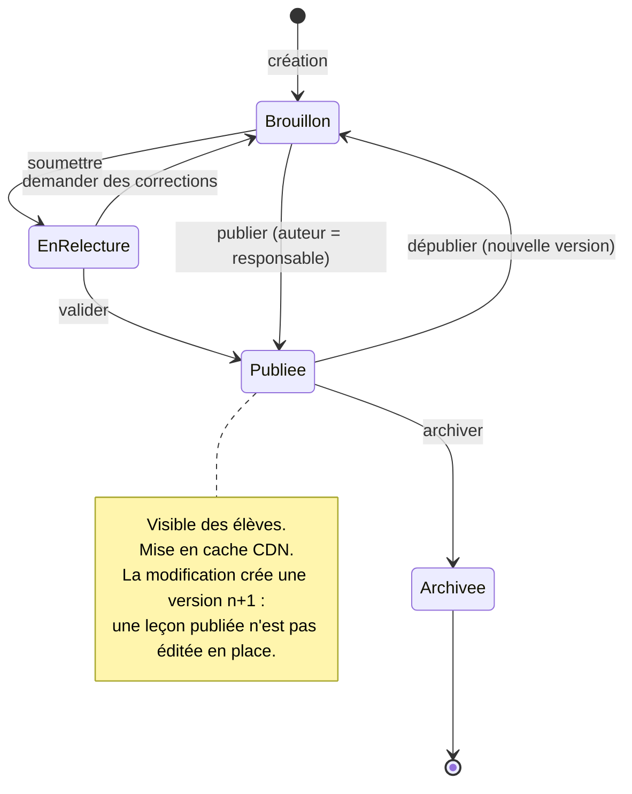
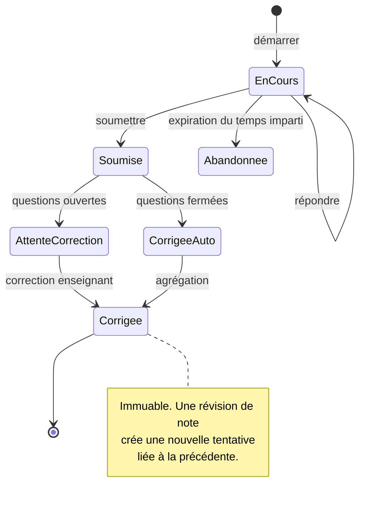
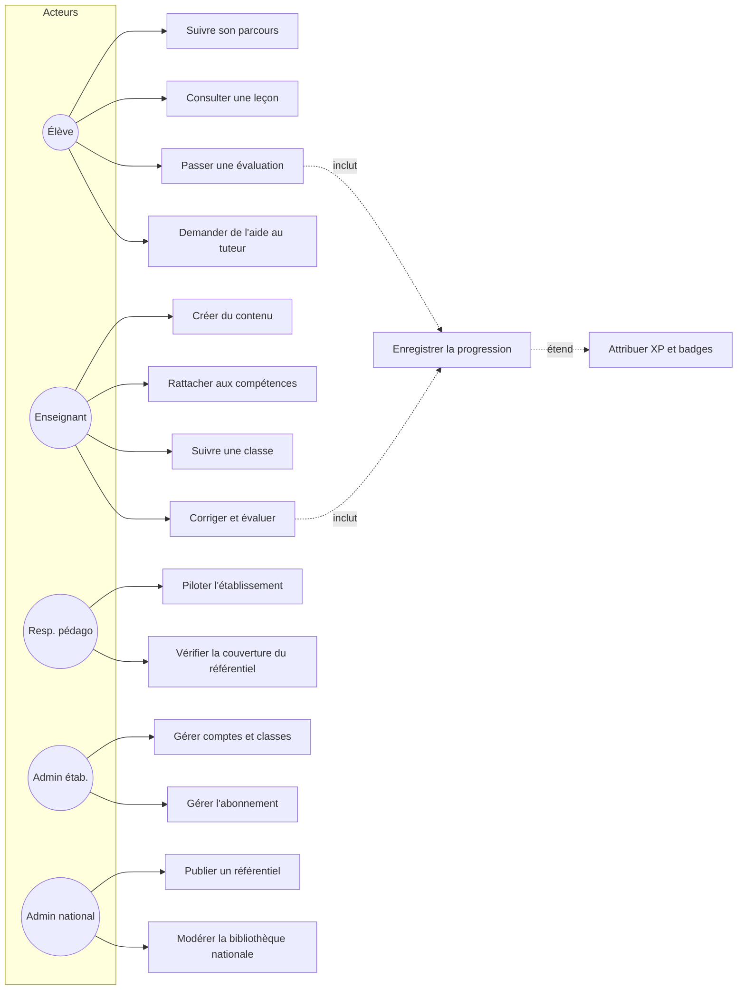

# 04 — Diagrammes UML

## 1. Classes du domaine — module `progression`

Le module le plus riche en règles métier, donc le plus utile à modéliser.

**Invariants portés par l'agrégat `Progression`** — ce sont eux qui justifient
que ce ne soit pas un simple CRUD :

1. Un acquis ne se dégrade jamais du fait d'une évaluation ratée. Un élève qui a
   validé une compétence puis rate un quiz reste validé ; seul un enseignant peut
   dégrader explicitement (`peutEtreDegrade()` renvoie `false` pour l'origine
   `EVALUATION`). Sans cette règle, la validation de compétences devient
   anxiogène et les élèves cessent de tenter.
2. `MAITRISEE` n'est atteignable que par deux constats distincts espacés d'au
   moins sept jours. Une réussite unique ne prouve pas la maîtrise.
3. Une déclaration d'enseignant l'emporte toujours sur un calcul automatique.
4. Tout changement de niveau publie un événement de domaine — c'est la seule
   voie par laquelle gamification et IA sont informées.

## 2. Séquence — inscription d'un élève (mode minimal)

Rien d'analogue à une inscription publique : **c'est l'établissement qui inscrit**.
Le parcours « pays → établissement → formation → niveau → classe » décrit dans le
cahier des charges est le parcours de l'**adulte** (BTS, licence pro, CFPPA) en
mode complet, et le parcours de **rattachement** en mode minimal, où l'élève ne
saisit qu'un code de classe.

## 3. Séquence — consultation d'une leçon (chemin chaud, 9h00)

La séparation du contenu (partagé, mis en cache) et de la progression
(personnelle, dynamique) est ce qui rend tenable le pic de rentrée en classe.

## 4. Séquence — tuteur IA (V1)

**La clé API ne quitte jamais le serveur.** Aucun appel IA depuis le navigateur,
jamais de variable `NEXT_PUBLIC_` contenant un secret de fournisseur. Règle
héritée de RAAI-Formation, reconduite sans exception.

## 5. États — leçon

La relecture n'est obligatoire que pour la **bibliothèque nationale** (V2). Dans
un établissement, un enseignant publie directement pour ses classes : imposer une
validation ferait fuir les utilisateurs dès la première semaine.

## 6. États — tentative d'évaluation

## 7. Cas d'usage — vue d'ensemble

