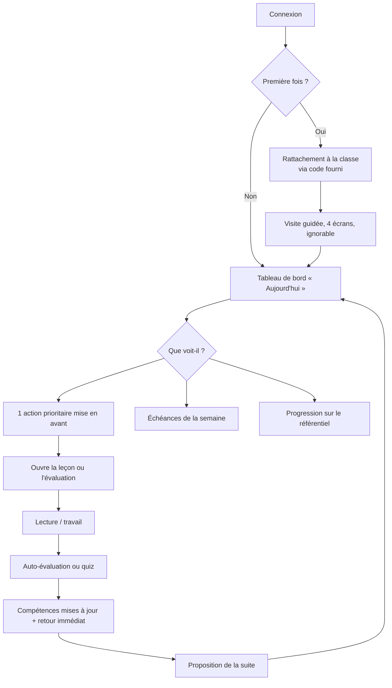
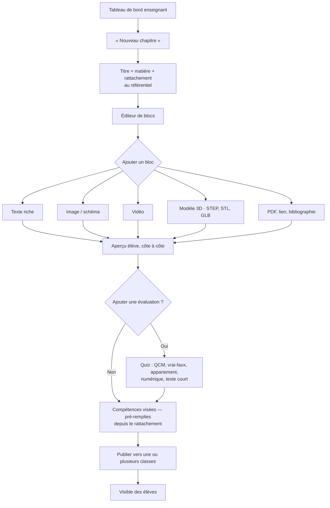
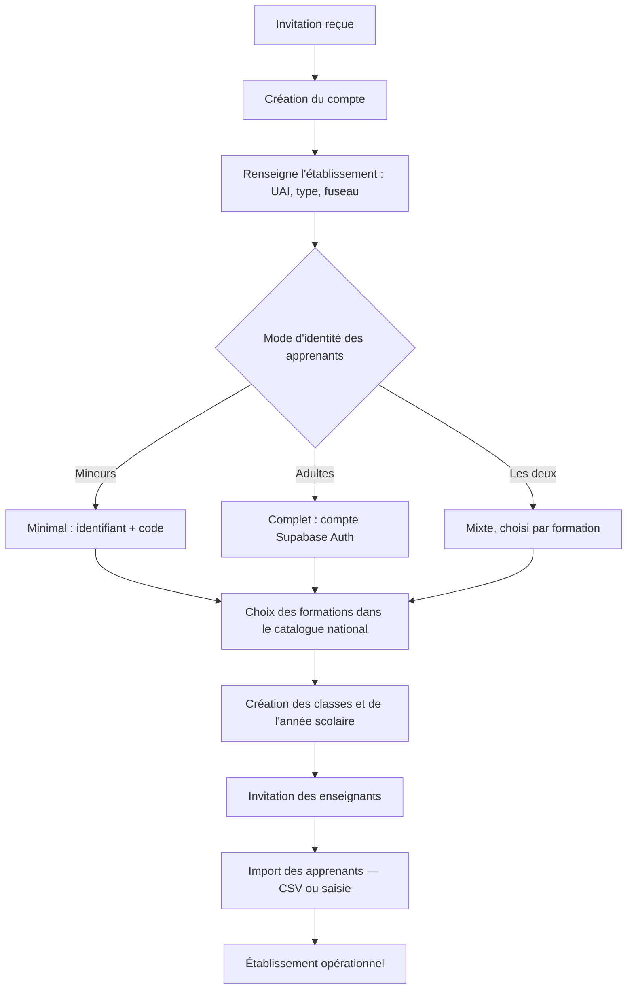

# 05 — Parcours utilisateurs

## Principe d'ensemble

Trois règles qui priment sur toute considération esthétique :

1. **Un écran répond à une question.** Le tableau de bord élève répond à
   « qu'est-ce que je fais maintenant ? ». Pas à « voici 14 indicateurs ».
2. **Aucun paramétrage obligatoire.** Un enseignant doit produire de la valeur
   avant d'avoir configuré quoi que ce soit. Le paramétrage est toujours différable.
3. **Le premier écran utile en moins de 3 clics** depuis la connexion, pour
   chaque rôle.

## 1. Élève — arrivée quotidienne



### L'écran « Aujourd'hui »

Hiérarchie visuelle, du plus important au moins important :

1. **Une seule action prioritaire**, en grand, avec sa durée estimée
   (« Hydraulique — chapitre 3 · 12 min »). Choisie par une règle simple en MVP
   (échéance la plus proche, puis compétence la moins avancée) ; par l'IA en V1.
2. Échéances de la semaine — trois maximum, le reste derrière « tout voir ».
3. Progression sur le référentiel : anneau de couverture, et la prochaine
   compétence à portée.
4. Le reste (badges, classement, historique, messages) est **sous la ligne de
   flottaison**. Ce sont des motivations, pas des informations.

Le tableau de bord demandé au cahier des charges liste 14 blocs. Les afficher
tous au même niveau produirait exactement le sentiment de saturation qu'on
reproche à Moodle. Ils existent tous ; ils sont hiérarchisés.

### Pendant la leçon

- Progression de lecture visible en continu.
- « Je n'ai pas compris » accessible à tout moment sur chaque bloc — en MVP, cela
  signale la difficulté à l'enseignant ; en V1, cela ouvre le tuteur IA en
  contexte.
- Reprise exacte là où l'élève s'est arrêté, y compris après une coupure réseau.
- Aucun mur : jamais de contenu bloqué derrière une réussite en MVP. Le
  déblocage progressif est un choix d'enseignant, pas un défaut.

## 2. Enseignant — création d'un chapitre

C'est le parcours qui décide de l'adoption. Objectif mesuré : **premier chapitre
publié en moins de 10 minutes, sans aide**.



Détails qui font la différence :

- **Le rattachement au référentiel se fait à l'étape 1**, pas à la fin. Placé en
  fin de parcours, il est systématiquement sauté — et sans lui, tout le suivi de
  compétences s'effondre.
- **L'aperçu élève est permanent**, en colonne. Pas un bouton « prévisualiser »
  qui change de page.
- **Import** : déposer un PDF ou un diaporama existant crée un premier jet de
  blocs. C'est souvent le vrai point de départ d'un enseignant.
- **Enregistrement automatique**, toujours. Aucun bouton « enregistrer ».

## 3. Enseignant — suivi d'une classe

Une seule vue, une grille **élèves × compétences**, code couleur à quatre niveaux.

```
                 C1.1  C1.2  C2.1  C2.2  C3.1
  Léa M.          ●     ●     ◐     ○     ○
  Thomas B.       ●     ◐     ○     ○     ○
  Inès K.         ●     ●     ●     ●     ◐
  ...
```

- Clic sur une cellule → détail des tentatives, et déclaration manuelle possible.
- Clic sur une colonne → qui bloque sur cette compétence, et sur quoi précisément.
- Clic sur une ligne → fiche élève.
- Un bandeau signale les élèves sans connexion depuis 14 jours. En MVP c'est un
  seuil fixe ; en V1, la détection de décrochage prend le relais.

Exports PDF / Excel / CSV depuis cette vue, sans passer par un écran dédié.

## 4. Responsable pédagogique — pilotage

Une question par carte, et un chemin vers le détail :

| Carte | Question |
|---|---|
| Couverture du référentiel | Quelles compétences ne sont couvertes par aucune ressource ? |
| Progression par classe | Quelles classes décrochent par rapport aux autres ? |
| Assiduité numérique | Qui ne se connecte plus ? |
| Réussite aux évaluations | Où les résultats s'effondrent-ils ? |
| Activité enseignants | Le déploiement avance-t-il ? |

La première carte est la plus utile et la moins fournie ailleurs : elle répond
directement à l'exigence d'inspection (« prouvez-moi que le référentiel est
couvert »). C'est un argument de vente autant qu'un outil.

## 5. Administrateur d'établissement — mise en route



Le choix du mode d'identité est **explicite et documenté dans l'interface**, avec
ses conséquences énoncées noir sur blanc : en mode minimal, pas d'email élève,
pas de récupération de compte autonome, pas d'accès parents. C'est un choix
juridique de l'établissement, pas un réglage technique — l'interface doit le dire.

## 6. Parcours d'inscription autonome (formations adultes)

Applicable aux BTSA, licences pro, CFPPA et écoles d'ingénieurs, où les
apprenants sont majeurs :

```
Pays → Établissement → Formation → Diplôme → Niveau → Classe → Année scolaire
```

Chaque étape filtre la suivante à partir des données réelles ; aucune liste ne
propose une option qui aboutirait à un cul-de-sac. À la fin, l'inscription est
**en attente de validation** par l'établissement — jamais automatique, sinon
n'importe qui rejoint n'importe quelle classe.

## 7. Les six parcours couverts par les tests bout en bout

1. Administrateur : créer un établissement jusqu'à une classe peuplée.
2. Enseignant : créer et publier un chapitre avec modèle 3D et quiz.
3. Élève (mode minimal) : se connecter, lire, répondre, voir sa progression.
4. Élève (mode complet) : s'inscrire, être validé, accéder au contenu.
5. Responsable : produire un export de couverture du référentiel.
6. Cloisonnement : un enseignant de l'établissement A ne voit rien de B.
