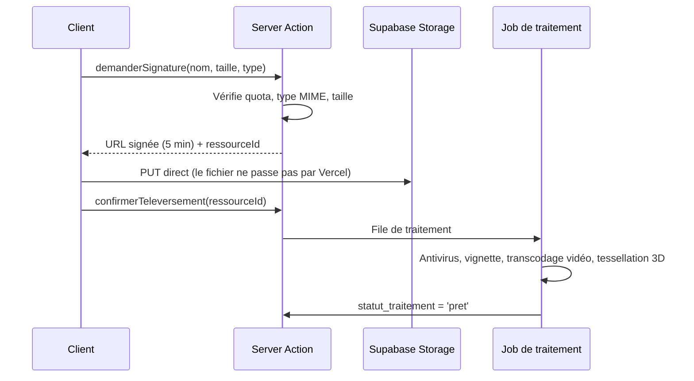

# 06 — API & Server Actions

## 1. Règle de répartition

| Besoin | Mécanisme | Pourquoi |
|---|---|---|
| Lecture par l'interface | Server Component | Pas d'aller-retour, pas d'endpoint à maintenir |
| Écriture depuis l'interface | Server Action | Typée de bout en bout, progressive enhancement |
| Webhook entrant | API Route | Stripe et consorts exigent une URL stable |
| Export volumineux | API Route en flux | Une Server Action ne diffuse pas un flux |
| Téléversement | URL signée Supabase | Le fichier ne transite pas par Vercel |
| Intégration tierce (ENT, Pronote) | API Route versionnée | Contrat public, cycle de vie propre |
| Flux IA | Route Handler en flux | `ReadableStream` vers le client |

**En pratique : Server Actions pour tout l'usage interne, API Routes uniquement
quand une URL stable est indispensable.** Ne pas construire une API REST complète
en doublon de l'interface — c'est le piège classique, et c'est deux fois le travail.

## 2. Contrat d'une Server Action

Forme unique, sans exception :

```ts
// domaines/catalogue/application/publier-lecon.action.ts
'use server'

const Entree = z.object({
  leconId: z.string().uuid(),
  classesIds: z.array(z.string().uuid()).min(1),
})

export async function publierLecon(
  _etatPrecedent: EtatAction,
  donnees: FormData,
): Promise<EtatAction<{ leconId: string }>> {
  const session = await exigerSession()                       // 1. authentifier
  const entree = Entree.safeParse(Object.fromEntries(donnees)) // 2. valider
  if (!entree.success) return echec('donnees_invalides', entree.error)

  const autorise = await peut(session, 'lecon.publier', entree.data.leconId)
  if (!autorise) return echec('non_autorise')                 // 3. autoriser

  const resultat = await casUsage.publierLecon(entree.data, session)  // 4. exécuter
  if (resultat.estErreur) return echec(resultat.code, resultat.details)

  revalidateTag(`lecon:${entree.data.leconId}`)               // 5. invalider
  await journaliser(session, 'lecon.publiee', entree.data)    // 6. auditer
  return succes({ leconId: entree.data.leconId })
}
```

Les six étapes sont **toujours dans cet ordre**, et une Server Action qui en omet
une est refusée en revue. L'ordre importe : autoriser avant de valider laisse
fuir la structure interne par les messages d'erreur ; auditer avant d'exécuter
journalise des actions qui n'ont pas eu lieu.

### Type de retour

```ts
type EtatAction<T = void> =
  | { statut: 'succes'; donnees: T }
  | { statut: 'echec'; code: CodeErreur; message: string; champs?: Record<string, string> }
```

Jamais d'exception remontée au client. Une exception non rattrapée est un bug,
elle part vers Sentry, et le client reçoit `erreur_interne` — sans détail.

### Nommage

Verbe à l'infinitif + objet, en français : `publierLecon`, `creerClasse`,
`rattacherCompetence`, `soumettreТentative`. Pas de `handleSubmit`, pas de
`createLessonAction`.

## 3. API Routes

```
/api/v1/webhooks/stripe          POST   signature vérifiée, idempotent
/api/v1/webhooks/resend          POST   bounces, plaintes
/api/v1/exports/classe/[id]      GET    flux CSV/XLSX
/api/v1/exports/referentiel/[id] GET    couverture, PDF
/api/v1/ia/tuteur                POST   flux SSE
/api/v1/medias/signature         POST   URL de téléversement signée
/api/v1/sante                    GET    sonde
/api/v1/integration/…            *      V2 — contrat public, clés par établissement
```

Règles :

- **`/api/v1/` dès le premier jour.** Renommer plus tard casse les intégrations
  d'établissements qu'on ne contrôle pas.
- Un webhook est **idempotent** : l'identifiant d'événement est stocké, un
  doublon est ignoré et renvoie 200. Stripe rejoue, c'est normal.
- **Signature vérifiée avant tout parsing.** Le corps brut est requis :
  `export const runtime = 'nodejs'` sur ces routes.
- Limitation de débit sur tout ce qui est public, via Redis
  ([09](09-securite-rgpd.md)).

### Codes de statut

| Code | Sens |
|---|---|
| 200 / 201 | Succès |
| 400 | Entrée invalide (détail par champ) |
| 401 | Pas de session |
| 403 | Session valide, droit absent |
| 404 | Inexistant **ou hors périmètre** — on ne distingue jamais les deux |
| 409 | Conflit (version obsolète, doublon) |
| 422 | Règle métier violée |
| 429 | Débit dépassé, avec `Retry-After` |

Le 404 sur hors-périmètre est délibéré : répondre 403 confirmerait à un
enseignant de l'établissement A l'existence d'une classe dans l'établissement B.

## 4. Téléversement de médias



Le fichier ne transite **jamais** par une fonction Vercel : limites de taille,
coût de bande passante, et durée d'exécution rendent l'inverse intenable pour un
STEP de 200 Mo.

Types acceptés en liste blanche stricte. Extension **et** signature binaire
vérifiées — l'extension seule ne prouve rien.

## 5. Conventions transverses

- **Idempotence** : toute Server Action d'écriture accepte une `cleIdempotence`.
  Un élève qui double-clique sur « soumettre » ne crée pas deux tentatives.
- **Optimistic locking** : les entités éditables portent `version`. Une écriture
  avec une version obsolète renvoie 409 avec le contenu à jour. Deux enseignants
  éditent la même leçon plus souvent qu'on ne le croit.
- **Pagination par curseur**, jamais par `offset`. À la centaine de millions de
  tentatives, `OFFSET 50000` est une requête morte.
- **Corrélation** : chaque requête porte un `idRequete` propagé jusqu'aux logs et
  à l'audit.
- **Toute Server Action de mutation est auditée** si elle touche une donnée
  personnelle, une note, une permission ou une facturation.
