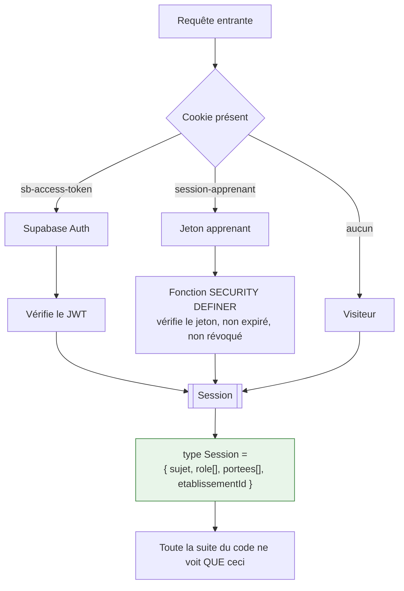

# 07 — Architecture des permissions

## 1. Modèle : rôle × portée

Un rôle seul ne suffit pas. « Enseignant » ne dit rien tant qu'on ne sait pas
*de quelles classes*. Chaque attribution est donc un couple **(rôle, portée)**.

```
Permission = Rôle × Portée × Action × Ressource
```

| Portée | Étendue |
|---|---|
| `nationale` | Tout le pays |
| `academie:<id>` | Une académie |
| `etablissement:<id>` | Un établissement |
| `classe:<id>` | Une classe |
| `soi` | Ses propres données |

Un même compte peut porter plusieurs attributions : un enseignant est souvent
aussi responsable pédagogique d'une formation. Les portées **s'additionnent**,
elles ne se remplacent pas.

## 2. Rôles et droits

| Rôle | Portée typique | Ce qu'il peut | Limite dure |
|---|---|---|---|
| `admin_national` | nationale | Référentiels, établissements, bibliothèque nationale | **Ne peut pas** lire une donnée nominative d'élève |
| `admin_academie` | académie | Vue agrégée, création d'établissements | Idem |
| `admin_etablissement` | établissement | Comptes, classes, abonnement, imports | Ne modifie pas une note |
| `responsable_pedagogique` | établissement ou formation | Toutes statistiques, toutes classes en lecture | Ne modifie pas une note |
| `enseignant` | ses classes | Créer, publier, corriger, déclarer des acquis | Rien hors de ses classes |
| `apprenant` | soi | Son parcours, ses résultats, contenu de ses classes | Aucun résultat nominatif d'autrui |
| `parent` | son enfant (V2) | Progression et assiduité | Ni productions détaillées ni messages |
| `visiteur` | — | Pages publiques | Rien de pédagogique |

**La limite de l'`admin_national` est structurelle, pas cosmétique.** Un
administrateur de la plateforme nationale n'a aucune raison légitime d'accéder
aux copies d'un élève de MFR. Les statistiques nationales sont agrégées, avec un
seuil minimal d'effectif (k ≥ 10) sous lequel rien n'est affiché — sinon
l'agrégat ré-identifie.

## 3. Double chemin d'authentification

Décision validée : **hybride, choisi par établissement**. C'est le point le plus
délicat du projet, parce que deux chemins d'auth mal isolés produisent des failles.



**La règle absolue** : au-delà du middleware, plus une seule ligne de code ne sait
d'où vient la session. Il n'existe qu'un type `Session`, qu'une fonction
`exigerSession()`, et aucune branche `if (estEleveMinimal)` dans les cas d'usage,
les composants ou les politiques RLS. Toute divergence en aval est un défaut.

### Mode minimal (mineurs) — hérité de RAAI-Formation

- Identifiant + code à 4 chiffres, créés par l'établissement.
- `bcrypt` sur le code. Jamais d'email, de nom complet ni de date de naissance.
- Jeton de session opaque en cookie `httpOnly`, `Secure`, `SameSite=Lax`, 30 jours.
- Révocable en un clic par l'enseignant.
- Limitation : 5 tentatives par identifiant et par heure, puis verrouillage
  jusqu'à déblocage par l'enseignant. Un code à 4 chiffres n'a que 10 000
  combinaisons — **sans cette limitation, le mécanisme n'a aucune valeur**.
- Aucune requête PostgREST directe depuis le navigateur d'un élève en mode
  minimal : uniquement des fonctions `SECURITY DEFINER` qui vérifient le jeton.

### Mode complet (majeurs)

- Supabase Auth, email + mot de passe, ou SSO établissement (V2).
- Récupération de mot de passe par email, MFA optionnelle.
- Réservé aux apprenants majeurs à l'inscription (`majeur_a_l_inscription`).

### Mode mixte

L'établissement choisit par formation. Un CFPPA peut avoir des BTSA en mode
complet et des Bac Pro mineurs en mode minimal. Le champ décisif est l'âge, pas
le niveau : un élève de BTS mineur reste en mode minimal.

## 4. RLS — deux fonctions et rien d'autre

Toute politique s'appuie sur deux fonctions `stable` :

```sql
-- Établissement du sujet courant, quel que soit son chemin d'authentification.
create or replace function raai_apprendre.etablissement_courant()
returns uuid language sql stable security definer
set search_path = raai_apprendre, extensions as $$
  select coalesce(
    (select etablissement_id from raai_apprendre.membre
      where compte_id = auth.uid() limit 1),
    (select a.etablissement_id
       from raai_apprendre.session_apprenant s
       join raai_apprendre.apprenant a on a.id = s.apprenant_id
      where s.jeton = current_setting('request.jwt.claims', true)::jsonb->>'jeton_apprenant'
        and s.expire_le > now() and s.revoquee_le is null)
  );
$$;

create or replace function raai_apprendre.a_droit(action text, portee text)
returns boolean language sql stable security definer as $$ … $$;
```

Politique type, appliquée sans variante :

```sql
alter table raai_apprendre.lecon enable row level security;
alter table raai_apprendre.lecon force row level security;

create policy lecon_lecture on raai_apprendre.lecon for select using (
  statut = 'publiee' and (
    etablissement_id is null                                    -- national
    or etablissement_id = raai_apprendre.etablissement_courant()
  )
);

create policy lecon_ecriture on raai_apprendre.lecon for all using (
  etablissement_id = raai_apprendre.etablissement_courant()
  and raai_apprendre.a_droit('lecon.ecrire', 'etablissement')
);
```

`force row level security` est indispensable : sans lui, le propriétaire de la
table contourne ses propres politiques.

**Aucune table n'est accessible sans RLS.** Le test automatisé §6 le vérifie
table par table, y compris sur les tables créées après coup — c'est là que les
oublis se produisent.

## 5. Autorisation applicative

La RLS protège les **données**. Elle ne protège pas les **actions** : « publier
une leçon » n'est pas une écriture de ligne unique. D'où une seconde couche.

```ts
// noyau/autorisation.ts
export async function peut(
  session: Session,
  action: Action,           // 'lecon.publier' | 'note.modifier' | …
  ressourceId?: string,
): Promise<boolean>
```

Deux couches, jamais une seule :

- La RLS est le **filet de sécurité** : même un bug applicatif ne peut pas faire
  fuir les données d'un autre établissement.
- `peut()` est la **règle métier** : elle produit des messages utiles et gère les
  actions qui ne se réduisent pas à des lignes.

Ne jamais retirer la première sous prétexte que la seconde existe.

## 6. Tests de permissions — bloquants

Trois familles, exécutées à chaque commit :

1. **Couverture RLS** : pour chaque table de `raai_apprendre`, `rowsecurity` est
   vrai et au moins une politique existe. Une nouvelle table sans RLS casse le build.
2. **Matrice rôle × table × opération** : sept rôles × toutes les tables ×
   `select/insert/update/delete`. Résultat attendu déclaré dans un tableau
   versionné ; tout écart échoue.
3. **Cloisonnement inter-établissements** : deux établissements peuplés, on
   vérifie qu'aucun sujet de A n'atteint une ligne de B — par requête directe,
   par Server Action, et par API Route.

C'est la suite de tests la plus importante du projet. Une fuite entre deux
établissements n'est pas un bug, c'est la fin de la crédibilité de la plateforme.

## 7. Élévation et délégation

- **Aucune élévation implicite.** Un `admin_etablissement` ne devient jamais
  enseignant d'une classe sans attribution explicite.
- **Impersonation pour le support** : possible, mais journalisée en audit,
  limitée à 30 minutes, notifiée à l'établissement, et **interdite sur un compte
  apprenant mineur**.
- **Délégation temporaire** : un remplaçant reçoit une attribution avec date de
  fin. L'expiration est effective en base, pas seulement dans l'interface.
