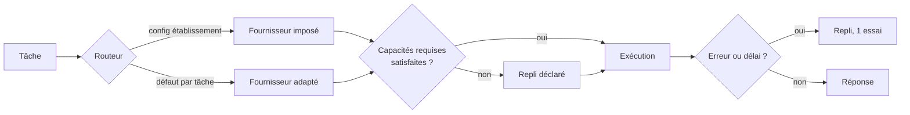
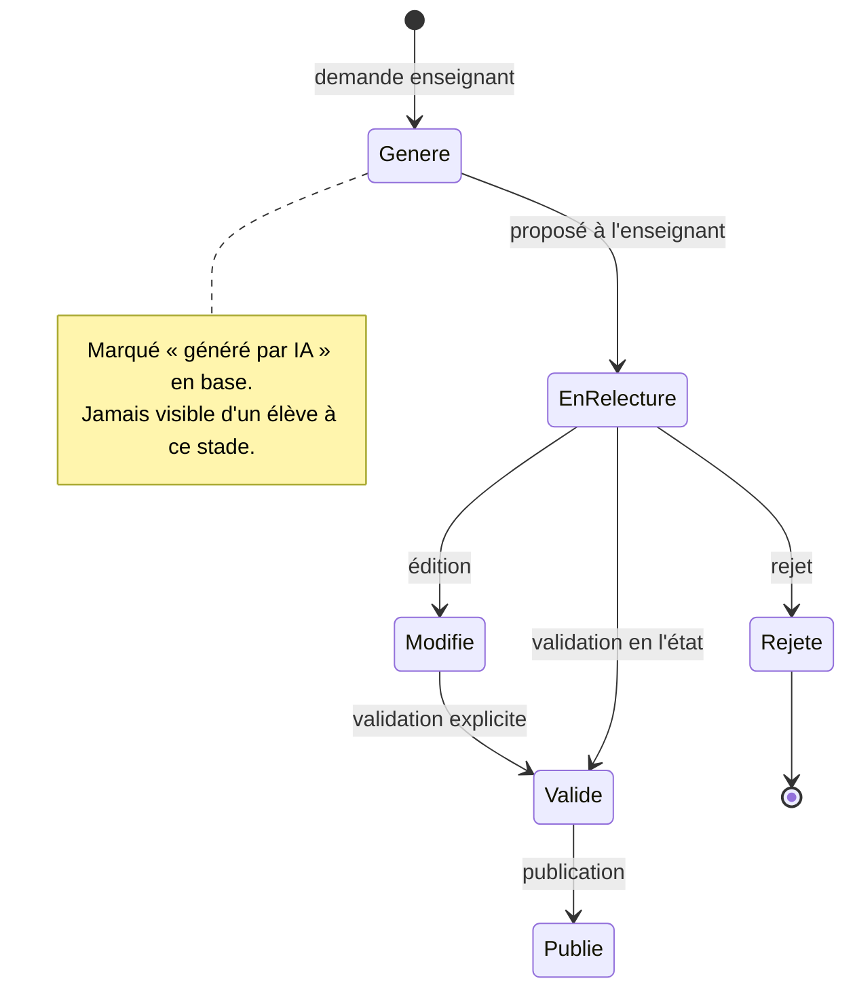

# 08 — Architecture IA

> Livrée en **V1**. Documentée maintenant parce que la couche d'abstraction et les
> points d'extension doivent exister dans le socle MVP, sinon on les rétro-ajoute
> mal.

## 1. Exigence

Claude, Gemini, OpenAI, Mistral et Ollama doivent être interchangeables **sans
modifier le reste du code**. Un établissement doit pouvoir imposer Mistral
(souveraineté) ou Ollama (auto-hébergement, données qui ne sortent pas).

## 2. Le port

Une seule interface, en périphérie du domaine :

```ts
// domaines/assistance-ia/ports/fournisseur-ia.ts
export interface FournisseurIA {
  readonly nom: NomFournisseur
  readonly capacites: CapacitesFournisseur

  completer(requete: RequeteIA): Promise<ReponseIA>
  completerEnFlux(requete: RequeteIA): AsyncIterable<FragmentIA>
  vectoriser?(textes: string[]): Promise<number[][]>
}

export type RequeteIA = {
  messages: MessageIA[]
  instructionSysteme?: string
  temperature?: number
  jetonsMax?: number
  schemaSortie?: JSONSchema     // sortie structurée, si supportée
  outils?: DefinitionOutil[]
}

export type ReponseIA = {
  texte: string
  structure?: unknown
  usage: { jetonsEntree: number; jetonsSortie: number; coutEstimeCentimes: number }
  fournisseur: NomFournisseur
  modele: string
}

export type CapacitesFournisseur = {
  flux: boolean
  sortieStructuree: boolean
  outils: boolean
  vision: boolean
  fenetreContexte: number
}
```

**`capacites` est essentiel.** Les fournisseurs ne sont pas équivalents : Ollama
avec un petit modèle local n'a ni sortie structurée fiable ni vision. Un routeur
qui l'ignore produit des échecs incompréhensibles en production. Le routeur
vérifie les capacités requises **avant** de router, et bascule sur un repli.

## 3. Routage par tâche

Le bon modèle dépend de la tâche, pas d'une préférence globale.

```ts
type Tache =
  | 'tuteur'              // conversationnel, latence critique, volume élevé
  | 'generation-quiz'     // sortie structurée, qualité critique, volume faible
  | 'reformulation'       // simple, très gros volume
  | 'analyse-copie'       // raisonnement, volume faible
  | 'detection-decrochage'// analyse par lots, hors ligne
  | 'vectorisation'       // recherche sémantique
```



Ordre de résolution : **configuration de l'établissement → défaut par tâche →
repli**. La configuration d'établissement l'emporte toujours ; c'est ce qui rend
la promesse de souveraineté réelle et pas décorative.

## 4. Maîtrise du coût

À 100 000 utilisateurs, l'IA est le premier poste de coût variable. Quatre leviers,
par ordre d'efficacité :

1. **Cache exact** (Redis, empreinte de la requête). « Explique-moi le débit
   hydraulique » est posé des milliers de fois sur la même leçon. Taux de succès
   attendu : 30 à 50 % sur le tuteur.
2. **Cache sémantique** (V2, pgvector) : question proche → réponse réutilisée,
   au-dessus d'un seuil de similarité prudent.
3. **Mise en cache du prompt** côté fournisseur : le contexte de leçon est
   identique pour tous les élèves d'une classe, il est marqué comme cachable.
4. **Quotas** par établissement et par mois, comptés côté serveur — repris de
   `quota_ia` dans RAAI-Formation. Compteur atomique Redis, réconcilié en base.

Chaque appel journalise tâche, fournisseur, modèle, jetons et coût estimé. Un
tableau de bord donne le coût par établissement. Sans cette instrumentation dès
le premier appel, la dérive n'est constatée qu'à la facture.

## 5. Le tuteur

**Il ne donne jamais la réponse.** Cette contrainte est structurelle, pas un
conseil dans le prompt :

- Instruction système explicite : questionner, décomposer, donner un exemple
  analogue — jamais le résultat attendu.
- Le contexte fourni au modèle contient l'énoncé et le cours, **jamais le
  corrigé**. Un modèle ne peut pas divulguer ce qu'il n'a pas.
- Après trois échanges sans progrès, le tuteur propose de solliciter l'enseignant
  et signale la difficulté dans le suivi de classe. Un élève bloqué doit finir
  chez un humain.

Contexte transmis : leçon courante, compétences visées, niveau d'acquisition de
l'élève, historique de la conversation. **Jamais le prénom, jamais l'identifiant.**
L'élève est un UUID pour le fournisseur.

## 6. Génération de contenu — validation humaine obligatoire

Règle héritée de RAAI-Formation, reconduite sans exception :

> **Aucun contenu généré ne part vers les élèves sans validation humaine.**



Et tant qu'une fonctionnalité de génération n'est pas branchée, l'interface dit
noir sur blanc qu'il s'agit d'un exemple (`<BandeauDemo />`). On n'affiche jamais
une démonstration sans le dire.

## 7. Détection de décrochage (V1)

Signaux exploités : absence de connexion, chute du temps passé, échecs répétés
sur une même compétence, abandon de tentatives, ralentissement relatif à la classe.

Garde-fous non négociables :

- **Aide à la décision uniquement.** Aucune conséquence automatique — pas de
  signalement administratif, pas d'orientation, pas de notification aux parents
  sans décision d'un enseignant.
- **Destinataire : l'enseignant**, jamais l'élève. « L'IA pense que tu décroches »
  est une phrase qui fait décrocher.
- **Explicabilité** : le signalement énonce les signaux (« aucune connexion depuis
  12 jours, 3 échecs sur C2.1 »), pas un score opaque.
- **Désactivable** par établissement.

Ce point relève du RGPD article 22 (décision automatisée). La conception l'écarte
en gardant l'humain décisionnaire à chaque étape.

## 8. Confidentialité

| Règle | Mise en œuvre |
|---|---|
| Clé API côté serveur uniquement | Aucune variable `NEXT_PUBLIC_` de fournisseur ; contrôle en CI |
| Pas de donnée personnelle vers un fournisseur | UUID au lieu du prénom ; filtre en sortie de construction du contexte |
| Pas d'entraînement sur nos données | Contrats et en-têtes d'exclusion, fournisseur par fournisseur |
| Souveraineté possible | Mistral (EU) ou Ollama auto-hébergé, au choix de l'établissement |
| Rétention | Conversations tuteur purgées à 12 mois |
| Information | Toute réponse IA est visuellement identifiée comme telle |

## 9. Ce que l'abstraction ne doit pas devenir

Le piège d'une couche multi-fournisseurs est le plus petit dénominateur commun.
Deux garde-fous :

- Les capacités spécifiques restent accessibles via `capacites`, sans être
  imposées à tous les fournisseurs.
- Le port ne grossit pas à chaque nouveauté d'un fournisseur. S'il faut une
  fonctionnalité exclusive, elle passe par une tâche dédiée avec un fournisseur
  requis et un repli déclaré, pas par une extension du contrat commun.
