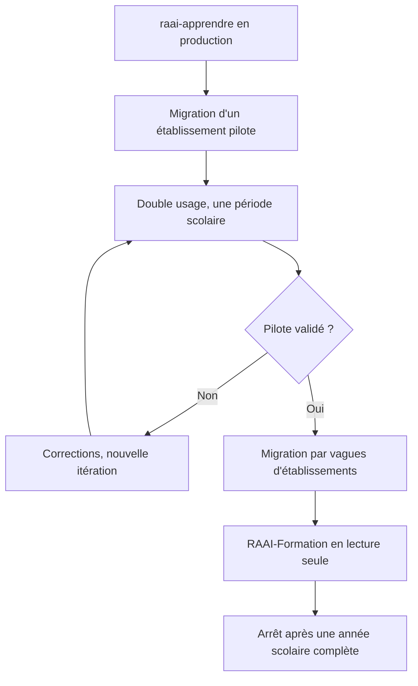

# 10 — Stratégie de déploiement

## 1. Environnements

| Env. | Branche | Base | Données | Usage |
|---|---|---|---|---|
| Local | — | PGlite, port 5433 | Jeu de démonstration | Développement |
| Aperçu | toute PR | Branche Supabase éphémère | Jeu de test | Revue |
| Recette | `recette` | Projet Supabase dédié | Anonymisées | Validation établissement pilote |
| Production | `main` | Projet Supabase prod | Réelles | `raai-apprendre.vercel.app` |

Aucune donnée réelle en aperçu ni en recette. L'anonymisation est un script du
dépôt, exécuté à la copie, pas une opération manuelle.

**Le local ne demande ni Docker ni PostgreSQL installé** : `npm run bd:locale`
monte PGlite, applique les migrations et sème le jeu de démonstration. C'est un
choix, pas une commodité — un environnement qui exige une mise en place préalable
est un environnement où l'on ne lance pas l'application « juste pour vérifier ».
Deux limites propres à PGlite, absentes en production : une seule connexion à la
fois, et des requêtes préparées non conservées (d'où `pgbouncer=true` dans
`DATABASE_URL`, que Supabase impose de toute façon derrière son pooler).

## 2. Pipeline

```mermaid
flowchart LR
    A[Commit] --> B[Lint · types stricts]
    B --> C[Tests domaine + application]
    C --> D[Tests permissions ⛔]
    D --> E[Tests intégration · Postgres éphémère]
    E --> F[Build + budget de perf ⛔]
    F --> G[axe-core accessibilité]
    G --> H[dependency-cruiser ⛔]
    H --> I[Déploiement aperçu]
    I --> J[Playwright · 6 parcours]
    J --> K{Fusion vers main}
    K --> L[Migrations]
    L --> M[Production]
    M --> N[Fumée + surveillance 15 min]
    N -->|échec| O[Retour arrière]
```



Les trois étapes ⛔ sont bloquantes sans dérogation possible : permissions, budget
de performance, matrice de dépendances. Ce sont les trois choses qui se dégradent
silencieusement et qu'aucune relecture humaine ne rattrape.

## 3. Migrations de base

Deux sources, un ordre :

1. **Prisma Migrate** pour le schéma (tables, colonnes, index).
2. **Migrations SQL versionnées** pour ce que Prisma ne modélise pas : politiques
   RLS, fonctions `SECURITY DEFINER`, déclencheurs, partitions, vues matérialisées.

Les deux vivent dans `prisma/migrations/`, numérotées ensemble. Une migration
Prisma qui crée une table **doit** être suivie de sa migration RLS dans le même
commit — le test de couverture RLS échoue sinon.

### Règles

- **Toujours rétro-compatible.** Le déploiement Vercel est progressif : ancien et
  nouveau code coexistent quelques minutes.
- Suppression de colonne en trois temps : cesser de lire → déployer → supprimer
  au déploiement suivant. Jamais dans le même.
- Les migrations lourdes (index sur `tentative`) : `CREATE INDEX CONCURRENTLY`,
  hors heures scolaires — **jamais entre 8h et 18h un jour de semaine**.
- Toute migration a son script de retour arrière, écrit et testé en recette.

## 4. Fenêtres de déploiement

Le rythme scolaire contraint le calendrier plus que la technique :

| Période | Politique |
|---|---|
| Lundi–vendredi, 8h–18h | Correctifs critiques uniquement |
| Semaine, 18h–22h | Déploiements normaux |
| Vacances scolaires | Migrations lourdes, changements structurants |
| Août | Fenêtre de reprise annuelle (bascule d'année scolaire) |
| Septembre, 2 premières semaines | **Gel** — c'est le pic d'usage et de découverte |

## 5. Variables d'environnement

```bash
# Base
DATABASE_URL=                     # pooler, applicatif
DIRECT_URL=                       # direct, migrations

# Supabase
NEXT_PUBLIC_SUPABASE_URL=
NEXT_PUBLIC_SUPABASE_ANON_KEY=
SUPABASE_SERVICE_ROLE_KEY=        # serveur uniquement, jamais exposée

# Redis
UPSTASH_REDIS_REST_URL=
UPSTASH_REDIS_REST_TOKEN=

# IA — serveur uniquement, sans exception
ANTHROPIC_API_KEY=
GOOGLE_AI_API_KEY=
OPENAI_API_KEY=
MISTRAL_API_KEY=
OLLAMA_BASE_URL=
IA_FOURNISSEUR_DEFAUT=claude

# Services
STRIPE_SECRET_KEY=
STRIPE_WEBHOOK_SECRET=
RESEND_API_KEY=
SENTRY_DSN=

# Application
NEXT_PUBLIC_URL_SITE=https://raai-apprendre.vercel.app
SECRET_SESSION_APPRENANT=         # signature des jetons élèves
```

Contrôle en CI : **toute variable dont le nom contient `KEY`, `SECRET` ou `TOKEN`
et commence par `NEXT_PUBLIC_` fait échouer le build.** Une clé exposée au
navigateur est irrécupérable — elle est publique dès le premier chargement.

Les variables sont validées au démarrage par un schéma Zod : l'application refuse
de démarrer si une variable requise manque, plutôt que d'échouer trois écrans
plus loin.

## 6. Régions et souveraineté

| Service | Région exigée |
|---|---|
| Vercel | `cdg1` (Paris) |
| Supabase | `eu-west-3` (Paris) |
| Upstash | `eu-west-1` |
| Sentry | UE |
| Resend | UE |

À vérifier explicitement à la création de chaque projet, et à re-vérifier au
moins une fois par an : les fournisseurs changent leurs offres régionales.

## 7. Bascule depuis RAAI-Formation



Point de vigilance : la bascule ne se fait **jamais en cours d'année pour un
établissement donné**. Une classe change de plateforme en septembre, pas en
février. Les vagues suivent donc le calendrier scolaire, pas le calendrier de
développement.

## 8. Astreinte et incidents

| Sévérité | Exemple | Réaction |
|---|---|---|
| S1 | Fuite de données, plateforme inaccessible en heures scolaires | Immédiate, retour arrière par défaut |
| S2 | Fonction majeure cassée (connexion élève, évaluation) | < 2 h ouvrées |
| S3 | Dégradation partielle | Prochain déploiement |
| S4 | Cosmétique | Backlog |

Toute S1 et S2 donne lieu à un post-mortem écrit, sans recherche de responsable,
avec au moins une action de prévention automatisée — un test ajouté vaut mieux
qu'une consigne.

## 9. Coûts prévisionnels

| Poste | MVP (10 étab.) | V2 (500 étab.) |
|---|---|---|
| Vercel | Pro | Enterprise |
| Supabase | Pro | Dédié + réplicas de lecture |
| Redis | Gratuit/Pay-as-you-go | Provisionné |
| Stockage + bande passante | Faible | **Poste principal** — les médias et modèles 3D dominent |
| IA | Contenu par quotas | Poste variable majeur, à surveiller quotidiennement |

Le stockage et la bande passante sont sous-estimés dans ce type de projet : un
million de ressources avec des vidéos et des modèles 3D pèse plus lourd que toute
la base relationnelle. La pré-tessellation et le transcodage
([02 §5](02-architecture-technique.md#5-visionneuse-3d)) sont autant des mesures
de coût que de performance.
