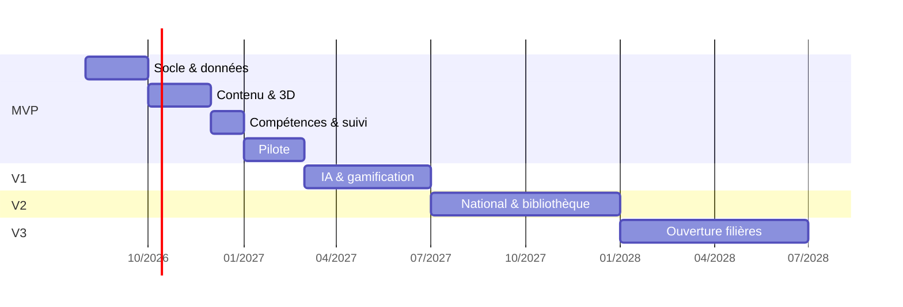

# 11 — Roadmap

## Principe

Chaque palier doit être **utilisable en établissement réel**. Aucun palier n'est
une étape intermédiaire technique : à la fin de chacun, un établissement peut
travailler avec, ou le palier est mal découpé.

Les durées sont indicatives et supposent une équipe restreinte (2 à 3 personnes).

---

## MVP — le socle (~6 mois, pilote inclus)

**Objectif** : un établissement pilote fait une année scolaire complète dessus.

### Contenu

| Lot | Détail |
|---|---|
| Socle | Académies, établissements, formations, niveaux, classes, années scolaires |
| Identité | Double chemin (minimal / complet), rôles, portées, RLS complète |
| Référentiels | Import assisté, versionnement, arbre compétences → savoirs |
| Contenu | Matières, modules, chapitres, leçons, blocs typés, éditeur, aperçu élève |
| Médias | Téléversement, images, vidéo, PDF, fichiers |
| 3D | STEP, STL, GLB ; pré-tessellation ; repli 2D |
| Évaluation | Quiz auto-corrigés, devoirs rendus, correction enseignant |
| Compétences | Liaison ressource ↔ compétence, acquis, vue élève et enseignant |
| Tableaux de bord | Élève « Aujourd'hui », enseignant grille classe × compétences |
| Pilotage | Couverture du référentiel, assiduité, exports PDF/Excel/CSV |
| Recherche | Plein texte français sur cours, ressources, compétences |
| Accessibilité | Responsive, clair/sombre, clavier, contrastes, RGAA AA sur 2 parcours |
| RGPD | Registre, notice, export, suppression, audit |
| Facturation | Stripe par sièges, abonnement établissement |
| Migration | Reprise du contenu et des comptes RAAI-Formation |

### Critères de sortie

Ceux du [cahier des charges §8](00-cahier-des-charges.md#8-critères-dacceptation-du-mvp),
plus :

- Les trois familles de tests de permissions au vert.
- Budget de performance respecté sur la page leçon.
- Un établissement pilote a mené une année scolaire sans incident S1.

### Explicitement absent du MVP

IA, gamification, messagerie, calendrier, parents, bibliothèque nationale, jeux,
CCF, anti-triche, traduction. Les ajouter au MVP repousserait le pilote d'un an —
et c'est le pilote qui dit si le produit est juste.

---

## V1 — engagement (~4 mois)

**Objectif** : les élèves y reviennent sans qu'on le leur demande.

| Lot | Détail |
|---|---|
| Abstraction IA | Port multi-fournisseurs, routage par tâche, quotas, cache, coûts |
| Tuteur | Socratique, en contexte de leçon, jamais la réponse |
| Génération | Exercices, QCM, fiches, flashcards, cartes mentales — validation humaine obligatoire |
| Détection | Décrochage et notions mal comprises, à destination de l'enseignant |
| Recommandation | Ressources pour valider une compétence précise |
| Gamification | XP, badges, succès, arbre de compétences, classements anonymes par défaut |
| Jeux | Quiz chronométrés, cartes mémoire, défis |
| Notifications | Resend + notifications internes, respectant le mode d'identité |
| Messagerie | Élève ↔ enseignant, modérée, journalisée |
| Calendrier | Échéances, planning, export iCal |
| Hors ligne | Service Worker, file de réponses différées |
| Accessibilité | Lecture audio, sous-titres, mode dyslexie |

### Critères de sortie

- Coût IA par élève actif mesuré et sous contrôle sur 3 mois.
- Retour à J+7 des élèves en hausse mesurable par rapport au MVP.
- Zéro contenu généré arrivé chez un élève sans validation (vérifié en audit).

---

## V2 — passage à l'échelle nationale (~6 mois)

**Objectif** : plusieurs centaines d'établissements, sans dégradation.

| Lot | Détail |
|---|---|
| Bibliothèque nationale | Contribution, modération, licences, banque de questions |
| Recherche sémantique | pgvector, cache sémantique IA |
| Parents | Comptes, portée limitée, consentement établissement |
| CCF & examens | Sessions, convocations, grilles, PV |
| Anti-triche | Signaux indicatifs, jamais de sanction automatique |
| Escape games, jeux sérieux | Éditeur de scénarios |
| Intégrations | ENT, Pronote, LTI, SSO établissement, imports annuaires |
| API publique | `/api/v1/integration/`, clés par établissement, documentée |
| Performance | Partitionnement, réplicas de lecture, vues matérialisées |
| Événements | Bus asynchrone, découplage effectif de la gamification et de l'IA |
| Traduction | Interface et contenu |
| Audit externe | Test d'intrusion, audit RGAA complet |

### Critères de sortie

- 500 établissements simulés en charge, pic 9h00 tenu.
- Certification d'accessibilité RGAA publiée.
- Test d'intrusion sans faille critique ni haute ouverte.

---

## V3 — ouverture aux filières techniques (~6 mois)

**Objectif** : industrie, mécanique, informatique, bâtiment, électronique, énergie.

| Lot | Détail |
|---|---|
| Référentiels MENJ | Bac Pro et BTS industriels, en plus du MASA |
| Simulations | Hydraulique, pneumatique, électricité, automatisme |
| Programmation | Python, C++, Arduino — exécution en bac à sable, correction automatique |
| CAO avancée | Annotation 3D, coupes, mesures, comparaison de versions |
| Ateliers virtuels | Usinage, soudage, maintenance |
| Certifications | Parcours certifiants, attestations vérifiables |
| Place de marché | Contenus de tiers, éditeurs, constructeurs |
| International | Autres pays, autres systèmes de référentiels |

Le modèle de données du MVP est déjà générique sur ce point : `DIPLOME` porte un
`ministere` et une `filiere`, et aucune table de référentiel n'est spécifique à
l'agriculture. V3 est une extension de données et d'outils, pas une refonte —
c'est délibéré, et c'est ce qui justifie l'effort de modélisation du
[document 03](03-modele-de-donnees.md).

---

## Ce qui reste hors périmètre, durablement

Vie scolaire réglementaire (bulletins, appel officiel), visioconférence intégrée,
génération d'emplois du temps, décisions automatisées à effet juridique,
surveillance des élèves par webcam ou capture d'écran.

Ces exclusions ne sont pas des manques à combler plus tard : ce sont des choix de
positionnement. Les inscrire ici évite de les redécouvrir en réunion tous les six
mois.

---

## Prochaine étape

Valider ce dossier — en priorité les documents
[00](00-cahier-des-charges.md), [03](03-modele-de-donnees.md) et
[07](07-permissions.md), qui portent les décisions coûteuses à défaire.

Le développement démarre ensuite par le socle : schéma, RLS et tests de
permissions **avant** le premier écran. C'est l'ordre qui protège tout le reste.
