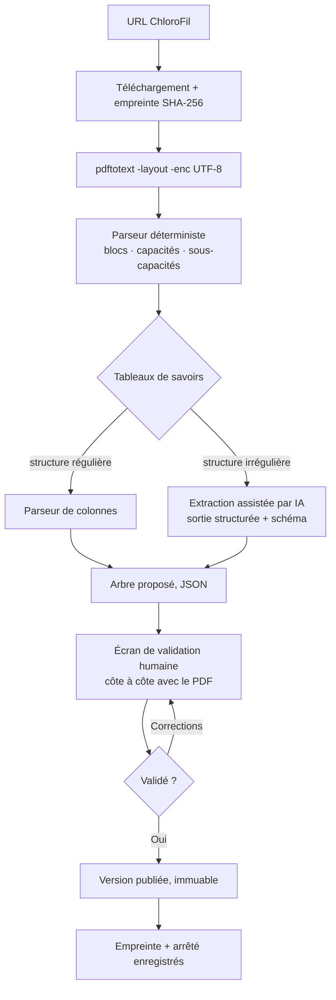

# 12 — Import des référentiels DGER

> Ce document lève le risque n°1 identifié au [cahier des charges §9](00-cahier-des-charges.md#9-risques-identifiés).
> Il s'appuie sur une extraction réelle du Bac Pro Agroéquipement, pas sur une estimation.

## 1. La source : ChloroFil

Les référentiels de l'enseignement agricole sont publiés par la DGER sur
**[chlorofil.fr](https://chlorofil.fr)**, en accès libre, sans authentification,
en PDF. Pour chaque diplôme on trouve : le référentiel de diplôme, les documents
d'accompagnement par module, les fiches descriptives d'épreuves, les grilles
d'évaluation et les sujets zéro.

URL type, stable et devinable :

```
https://chlorofil.fr/fileadmin/user_upload/02-diplomes/referentiels/
  secondaire/bacpro/<code-filiere>/<fichier>.pdf
```

## 2. Piège vérifié : le fichier « en vigueur » ne l'est pas

Le fichier nommé `bac-pro-ae-ref-en-vigueur.pdf` contient le référentiel de
l'**arrêté du 23 juillet 2010**. Le référentiel réellement applicable est celui
de l'**arrêté du 21 mars 2023**, modifié le 15 avril 2024 — déployé en tronc
commun à la rentrée 2023, en première en 2024, en terminale en 2025. Il est
publié sous le nom `bac-pro-ae-projet-ref.pdf` (78 pages).

Les deux référentiels sont **incompatibles** : le C5 de 2010 est « Caractériser le
fonctionnement des matériels », celui de 2023 est « Choisir un équipement adapté
à un contexte en lien avec les transitions ». Importer le mauvais fichier
produirait un arbre de compétences faux et silencieusement plausible.

**Conséquence de conception** : le nom de fichier n'est jamais une source
d'autorité. L'import extrait la référence d'arrêté **du contenu du document**, et
la confronte à une saisie humaine avant validation. Cela justifie a posteriori le
champ `VERSION_REFERENTIEL.reference_arrete` du
[modèle de données](03-modele-de-donnees.md#3-erd--référentiel-national).

## 3. Structure réelle du référentiel rénové

Bonne nouvelle : elle correspond exactement au modèle prévu, à un niveau près.

```
DIPLÔME  Bac Pro Agroéquipement
  └─ VERSION  arrêté 21/03/2023 mod. 15/04/2024
       ├─ BLOC DE COMPÉTENCES   B1 … B10        (10)
       │    └─ CAPACITÉ          C1 … C10        (10, une par bloc)
       │         └─ SOUS-CAPACITÉ C1.1 … C9.2    (22)
       │              └─ SAVOIRS MOBILISÉS       (~150, en tableau)
       └─ MODULES DE FORMATION  MG1–MG4, MP5–MP9 (9)
```

Un bloc correspond à une capacité de rang 1 — le référentiel le dit explicitement :
« Chaque capacité globale (de rang 1) correspond à un bloc de compétences. »

Deux écarts avec le modèle du document 03, à corriger :

1. **`BLOC_COMPETENCE` et `COMPETENCE` sont en relation 1–1**, pas 1–n. Le modèle
   les traitait comme deux niveaux distincts ; ils n'en font qu'un. À simplifier
   avant d'écrire le schéma, sinon on crée une table vide de sens.
2. **`C10` n'a pas de sous-capacité** ni de bloc numéroté : c'est le module
   d'adaptation professionnelle (MAP), défini régionalement. Le modèle doit
   accepter une capacité terminale sans enfant, et une compétence dont le contenu
   est défini par l'établissement — ce qui contredit le principe « aucun
   `etablissement_id` dans le référentiel ». **Exception à traiter explicitement** :
   une table `adaptation_locale` rattachée à la capacité, portant, elle, un
   `etablissement_id`.

Ces deux points auraient été découverts à l'implémentation. Les découvrir
maintenant coûte une modification de document ; plus tard, une migration.

## 4. Faisabilité mesurée

Extraction avec `pdftotext -layout -enc UTF-8`, puis parseur de 60 lignes.
Résultat sur le Bac Pro Agroéquipement :

| Élément | Attendu | Extrait | Correct |
|---|---|---|---|
| Capacités de rang 1 | 10 | 10 | 10 |
| Sous-capacités | 22 | 22 | 22 |
| Rattachement bloc ↔ capacité | 9 + MAP | 9 + MAP | 9 + MAP |
| Intitulés propres | 32 | 32 | **31** |

Une seule erreur : l'intitulé de `C4.3` absorbe le paragraphe d'introduction des
capacités professionnelles, parce que ce paragraphe commence par une minuscule et
que la règle de continuation de ligne le prend pour une suite d'intitulé. Corrigé
par une garde sur la longueur et sur les intitulés de section.

**Le texte est nativement extractible — ce ne sont pas des images scannées.**
C'était l'hypothèse pessimiste ; elle est levée.

Ce qui reste difficile : les **savoirs mobilisés** sont dans des tableaux à
3–4 colonnes (champ de compétences · SPS · capacités évaluées · savoirs) que
`-layout` aplatit en colonnes désalignées. C'est là que se concentre l'effort.

## 5. Stratégie d'import retenue



Trois principes :

- **Déterministe d'abord, IA seulement pour les tableaux.** L'arbre principal
  s'extrait par expressions régulières, sans IA : c'est reproductible, gratuit,
  auditable. L'IA n'intervient que sur les tableaux irréguliers, avec sortie
  structurée contrainte par un schéma, et sa proposition passe par la même
  validation humaine.
- **La validation humaine est obligatoire**, conformément à la règle générale du
  projet ([08 §6](08-architecture-ia.md#6-génération-de-contenu--validation-humaine-obligatoire)).
  Un référentiel faux corrompt tout le suivi de compétences de milliers d'élèves.
- **L'empreinte du PDF source est conservée.** Elle permet de détecter qu'un
  référentiel a été republié par la DGER, et de déclencher une revue.

## 6. Chiffrage

| Lot | Charge | Commentaire |
|---|---|---|
| Récupération et catalogage ChloroFil | 2 j | Liste des diplômes, URL, arrêtés |
| Parseur d'arbre (blocs → sous-capacités) | 3 j | Prototype déjà fonctionnel |
| Parseur de tableaux de savoirs | 5 j | Le vrai coût ; plusieurs mises en page |
| Extraction assistée IA en repli | 3 j | Sortie structurée + schéma |
| Écran de validation côte à côte | 5 j | Indispensable, pas optionnel |
| Versionnement et équivalences inter-versions | 3 j | Requis par la réforme 2023 en cours |
| Import des 5 premiers diplômes, validé | 5 j | Dont ~1 j de relecture humaine par diplôme |
| **Total** | **~26 j** | ≈ 5 semaines pour une personne |

Coût récurrent après mise au point : **environ une demi-journée de relecture
humaine par diplôme**, l'extraction elle-même étant automatique.

C'est nettement moins que l'hypothèse haute retenue au cahier des charges, qui
supposait des PDF non extractibles. **Le lot d'import reste dans le MVP**, sans
décaler le pilote.

## 7. Diplômes prioritaires

| Ordre | Diplôme | Raison |
|---|---|---|
| 1 | Bac Pro Agroéquipement | Cœur de cible, référentiel déjà analysé |
| 2 | Bac Pro CGEA / Conduite et gestion de l'entreprise agricole | Effectif le plus large en MFR et lycées agricoles |
| 3 | CAPa Métiers de l'agriculture | Amont, mêmes établissements |
| 4 | BTSA GDEA (génie des équipements agricoles) | Prolonge le Bac Pro AE, valide le modèle sur le supérieur |
| 5 | Tronc commun Bac Pro | Mutualisé — B1 à B4 sont **identiques pour tous** les Bac Pro du ministère |

Le point 5 est un gain structurel : les capacités générales C1–C4 sont communes à
tous les Bac Pro agricoles. Elles s'importent **une seule fois** et se partagent
entre tous les diplômes. Le modèle national du document 03 le permet déjà ; il
faut simplement que l'import ne les duplique pas par diplôme.

## 8. Où vit l'outil

Le prototype de cette étude a été repris dans **`outils/import-referentiel/`**,
couvert par six tests. Il s'invoque depuis la racine :

```bash
npm run referentiel:importer -- <url-chlorofil|chemin.pdf> [--json sortie.json]
```

**Il n'écrit rien en base**, par construction : la validation humaine du §5 reste
obligatoire, et l'écran de validation côte à côte n'est pas écrit. Les six tests
s'abstiennent **visiblement** quand `pdftotext` est absent de la machine — une
abstention annoncée, jamais un vert silencieux.

---

**Sources :**

- [Bac pro Agroéquipement — ChloroFil.fr](https://chlorofil.fr/diplomes/secondaire/bac-pro/1re-term/agroequip)
- [Référentiel rénové, arrêté du 21 mars 2023 mod. 15 avril 2024 (PDF, 78 p.)](https://chlorofil.fr/fileadmin/user_upload/02-diplomes/referentiels/secondaire/bacpro/agroequip/bac-pro-ae-projet-ref.pdf)
- [Référentiel de 2010, arrêté du 23 juillet 2010 (PDF) — obsolète](https://chlorofil.fr/fileadmin/user_upload/02-diplomes/referentiels/secondaire/bacpro/agroequip/bac-pro-ae-ref-en-vigueur.pdf)
- [Fiche descriptive d'épreuve E6 (PDF)](https://chlorofil.fr/fileadmin/user_upload/02-diplomes/examens/epreuves-terminales/fiches-descript/fiches-bacpro/FE_BPro_Agroequipement_E6.pdf)
- [Sujet zéro E5, avril 2024 (PDF)](https://chlorofil.fr/fileadmin/user_upload/02-diplomes/referentiels/secondaire/bacpro/agroequip/bacpro-ae-docomp-sujet0-2-042024.pdf)
- [Bac pro enseignement agricole — tronc commun](https://chlorofil.fr/diplomes/secondaire/bac-pro/1re-tle/tronc-commun)
